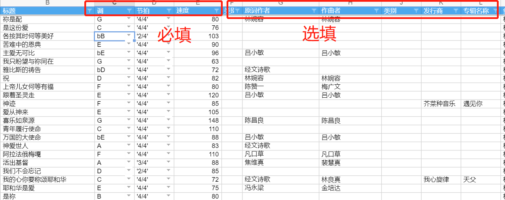
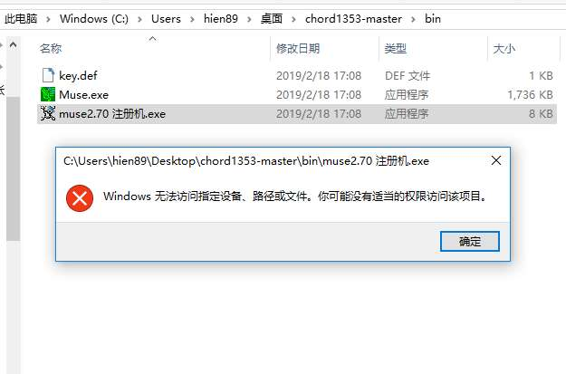

#  介绍

本次制谱的诗歌本是：[赞美诗歌(1384首)](https://www.zanmeishi.com/songbook/32.html) 1353+31短歌；

下载原版谱链接：https://pan.baidu.com/s/1ip9tleArGv6Z-snHSNbk2Q 提取码：i28w  ；


`赞美诗歌(1384首)`发布时间为2008年，受众广泛，现存的`2008版简谱图片版本(简称v1)`有较多瑕疵，

- `2019.2简谱重制版(简称v2)`是基于`870首 颂主圣诗`模板的重制版，制作方式是通过`ps软件进行修理/重制`，[相关背景](https://mp.weixin.qq.com/s/zCDR5XIvoTCfuISDh_yGwg)，下载地址；

- 本项目为`2019.x和弦重制版(v3)`，旨在解决键盘手、吉他手对和弦谱的需求；

  - 由于v2版的简谱重制版无可复用的素材，本版本需要进行重新制作；


# 我可以如何为此项目贡献

- 点击[公共石墨表格](https://shimo.im/sheets/JaBLXcmeE9IKgFsi/MODOC)，在这个表格中补充`歌曲元数据`，越详尽越有助于这个项目后期的`复用`；
  - 查看[赞美诗歌(1384首)](https://www.zanmeishi.com/songbook/32.html)信息/搜索网上相关诗歌信息；
  - 注意石墨公共表格，直接在表格中补充表格信息即可，`无需下载、保存表格`；



- 制谱：简谱/和弦谱/贝斯谱/吉他谱
  - 本项目使用`脚本制谱`（即内容与格式分离，类似markdown），一方面将精力聚焦在制谱内容，另一方面`脚本`也可大幅增强编辑信息的`复用性`，以便于可以将更多精力聚焦在`组谱`上；
  - 具体参考下一章`制谱流程`；


# 制谱流程

- 安装/学习`制谱软件`：并通过`模板脚本`快速学习制谱脚本`语法规则`以及`基本功能`；
- 制作：按照领取的诗歌分配目录制作`和弦脚本`，文件名按照`诗歌序号`命名(如 `0001.jsx`、`0123.jsx`)；
- 提交：制作完成后，将脚本统一放在一个文件夹中，并以`诗歌序号区间`命名 (如`0001-0030.zip`），或发送到微信群；
  - 也可安装git协同软件，直接不解压缩提交到本项目下的`/score/`目录，这样更方便； 


## 安装/学习`制谱软件`

- 在windows(win98-win10都可以)操作系统上安装`muse2.70 pro`；

  - 退出当前杀毒软件：由于`破解注册机`会读取系统硬件驱动信息；

    - 为何使用此盗版：原作者在10+年以前由于盗版泛滥的原因已经不再维护此软件，网上也无购买正版license途径，现在只能使用注册机，也提醒大家尽量不要使用盗版软件，像这款20年前就开发好的软件没人维护实在可惜；╮(╯▽╰)╭
  - 下载本工程/软件

  - 使用解压软件提取`chord1353-master.zip`(不要使用`360压缩`，可能会误删除)；

  - 点击`bin/muse2.70 注册机.exe`->复制显示注册码，点击`帮助->输入注册码`，粘贴确认；

    

    

- 学习语法规则

  - 启动ctrl + o 打开`/tmplate/欢乐颂.jcx`

```
T: 欢乐颂 %% 标题
C: 曲:Ludwig van Bethoven %% 作者信息
C: 词:洪启元 %% 作者信息
M: 4/4 %% 节拍
L: 1/4
K: C %% 调号
V:1 style=jianpu %% 音轨，不需要修改
[V:1] %% 表示后面的内容都是音轨1，不需要修改

"C" E E F G |"G" G F E D |"C" C C D E |"G" E > D D2 |
w: 欢欣欢欣齐来敬拜 荣耀慈爱大主宰

"C" E E F G |"G" G F E D |"C" C C D E |"G" D3/2 C/2 "C" C2 |
w: 如同花朵向日绽放情 我们心向主敞开

"G" D D "C" E C |"G" D E/2F/2 "C" E C |"Dm" D E/F/ E D |"C" C D G, (E |
w: 黑暗忧愁罪恶*阴霾 靠主*大能尽驱散，赐

E) E F G |"G" G F E D |"C" C C D E |"G7" D3/ C/ "C" C2 |]
w: *下祝福欢欣喜乐 光明与我永同在。

```


```
T: 欢乐颂 %% 标题
C: 曲:Ludwig van Bethoven %% 作者信息
C: 词:洪启元 %% 作者信息
M: 4/4 %% 节拍
L: 1/4
K: C %% 调号
V:2 style=jianpu name="简谱"
V:1 style= sheet name="五线谱" %%这里的顺序决定后面的顺序

[V:1] %% 表示后面的内容都是音轨1，不需要修改
 E E F G | G F E D |"C" C C D E |"G" E > D D2 |
[V:2] %% 表示后面的内容都是音轨1，不需要修改
"C" E E F G |"G" G F E D |"C" C C D E |"G" E > D D2 |

```


- 基本功能
  - 设置`每行4小节`预览：


- 点击预览


## 制作

制作：按照领取的诗歌分配目录制作`和弦脚本`，文件名按照`诗歌序号`命名(如 `0001.jsx`、`0123.jsx`)；

具体的`\chord1353\score`


## 提交

提交：制作完成后，将脚本统一放在一个文件夹中，并以`诗歌序号区间`命名 (如`0001-0030.zip`），或发送到微信群；

- 也可安装git协同软件，直接不解压缩提交到本项目下的`/score/`目录，这样更方便；


# 批量预处理歌词

- 基于`zanmeishi.com`提供的搜索api，使用chrome浏览器F12执行`script/fetch.js`：

```
https://www.zanmeishi.com/search/autosuggest/?k=qyed
https://api.zanmeishi.com/song/text?song_id=123
```

基本处理函数使用`YLyric.vue`的`lyricProcessor`，

```
function lyricProcessor(lyric) {
        //嘿嘿，要开始处理不规则的歌词
        let f1 = lyric.split('\n').filter((x, i) => !x.match(/[:|：]/g))       //过滤带:或：行
        let f2 = []       //处理超长一行特别长的
        f1.forEach(x => {
          if (x.length > 18) {
              f2=f2.concat(x.split(/,|。|，|、|\./))
          }else{
              f2.push(x)
          }
        })
```

另外需要导出文件

`/,|。|，|、|\./`，

《 》 <>' “ "，. 。，!！

# F&A

Q：安装注册提示



使用右键->管理员方式打开；

# 其他的脚本制谱软件

[latex musixtex插件](https://blog.csdn.net/u012136352/article/details/80027125)

[vexTab](https://www.52cmajor.com/doc?doc=vextab)


[abcjs](https://github.com/paulrosen/abcjs)

# 